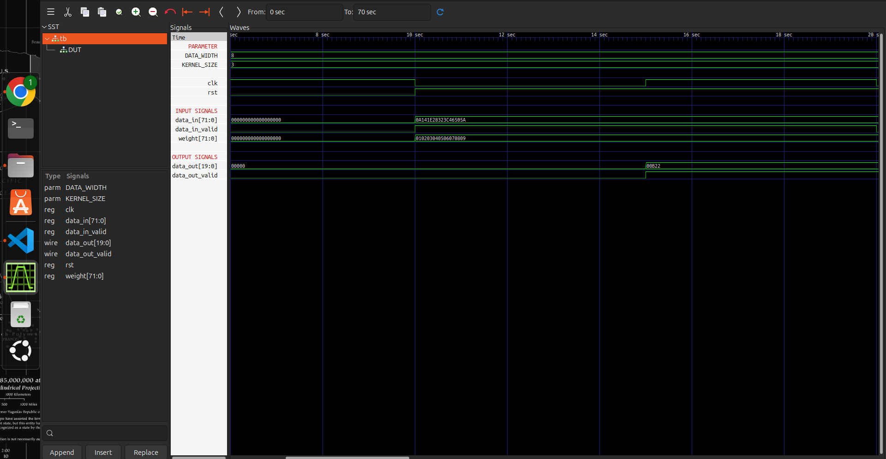

# MAC Unit (Multiply Accumulate Unit)

This module performs the multiply and accumulate operation used in the processing pipeline.

## Description

The MAC unit multiplies input data with the corresponding weights and accumulates the results to generate the final output.

In my design, I only needed to compute the sum of 9 multiplication results for a 3x3 kernel, so the final accumulation stage is hardcoded as:

```verilog
data_out <= temp[0] + temp[1] + temp[2] + temp[3] + 
            temp[4] + temp[5] + temp[6] + temp[7] + temp[8];
```

You can modify this accumulation logic based on your kernel size or design requirements.

## Configuration

The design supports configurable parameters:

* `DATA_WIDTH` - Input data width can be changed based on the requirement.

## Output Waveform

The simulation waveform shows the working of the MAC unit. It verifies multiplication of input data with weights and accumulation of all results to generate the final output.



## Note

This implementation was created based on the requirements of one of my designs. Modify the accumulation stage if more or fewer operations are required.


