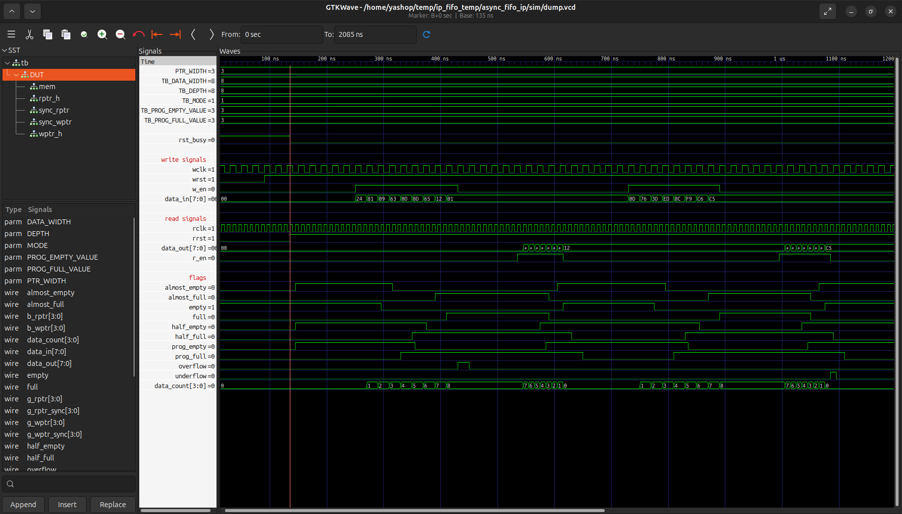

# Async FIFO IP

A parameterized asynchronous FIFO IP supporting independent write and read clock domains. The top-level module for integration is `async_top.v`.

## Folder Structure

```text
Async-FIFO/
├── rtl/
│   ├── async_top.v
│   ├── memory.v
│   ├── wptr_handler.v
│   ├── rptr_handler.v
│   └── 2_ff_synchronizer.v
├── tb/
│   └── async_fifo_tb.v
├── images/
│   └── async_fifo_waveform.png
└── README.md
```

## Default Parameters

```verilog
parameter DEPTH            = 8;
parameter DATA_WIDTH       = 8;
parameter PROG_FULL_VALUE  = (DEPTH/2) - 1;
parameter PROG_EMPTY_VALUE = (DEPTH/2) + 1;
parameter MODE             = 1;
```

| Parameter | Description |
| --------- | ----------- |
| DEPTH | FIFO depth (power of 2 recommended) |
| DATA_WIDTH | Width of each data word |
| PROG_EMPTY_VALUE | `prog_empty` threshold |
| PROG_FULL_VALUE | `prog_full` threshold |
| MODE | `0` = FWFT, `1` = Standard |

## Operating Modes

* MODE = 0: FWFT (First Word Fall Through)
* MODE = 1: Standard FIFO

## Verification

The FIFO has been functionally verified using the provided testbench with multiple write and read clock combinations.

### Output Waveform



## FPGA Validation

The design was synthesized and tested on the Efinix Trion T120 FPGA.

| Configuration | Maximum Frequency |
| ------------------------------ | ----------------: |
| DEPTH = 8, DATA_WIDTH = 8 | 147.601 MHz (wclk), 151.950 MHz (rclk) |
| DEPTH = 16384, DATA_WIDTH = 64 | 123.411 MHz (wclk), 121.183 MHz (rclk) |

---

## Notes

This FIFO IP is fully parameterized, easy to integrate into FPGA designs using the `async_top.v` module, and has been verified through simulation and hardware testing on the Efinix Trion T120 FPGA.
```
