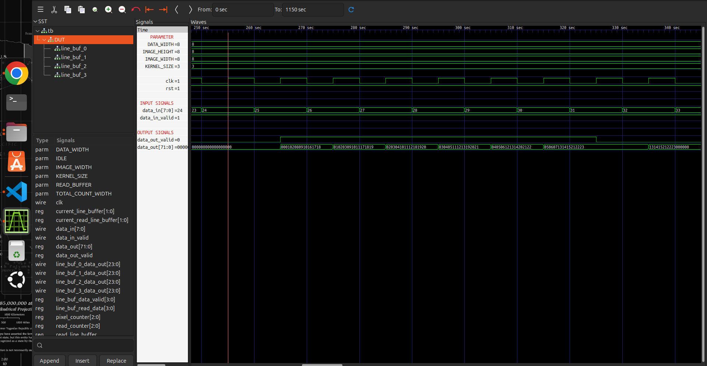

# Line Buffer and Control Logic (3x3 Kernel)

This contains two Verilog modules used for generating a 3x3 pixel window in a streaming image processing pipeline.

## Files

* `line_buffer.v`
  Stores incoming pixel rows and provides buffered pixel data required for 3x3 kernel operations.

* `control_logic.v`
  Handles the control flow of the line buffer, including buffer switching, read/write control, and managing the data flow between buffers.

## Configuration

The design supports configurable parameters:

* `DATA_WIDTH` - Pixel data width can be changed based on the requirement.
* `IMAGE_WIDTH` - Set according to the input image width.
* `IMAGE_HEIGHT` - Set according to the input image height.

Only these parameters need to be configured before using the module.

## Output Waveform

The simulation waveform shows the working of the line buffer and control logic. It verifies pixel storage, buffer switching, and generation of the 3x3 kernel window.

## Note

This implementation is designed specifically for a **3x3 kernel**. The buffer structure and control logic were created based on the requirements of one of my designs, so modifications may be needed for other kernel sizes or architectures.

