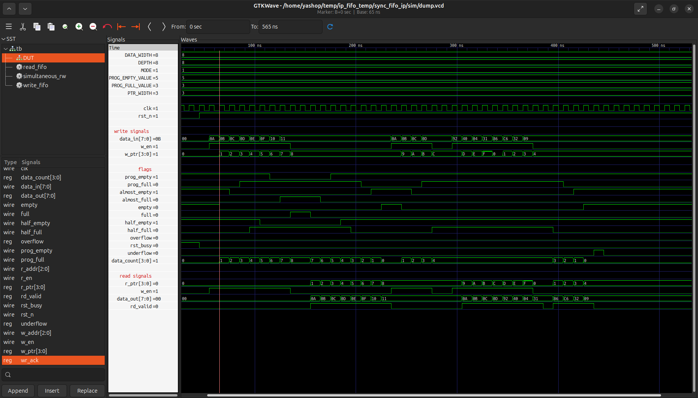

# Sync FIFO IP

A parameterized synchronous FIFO IP supporting both Standard and FWFT (First Word Fall Through) modes.

## Folder Structure

```text
Sync-FIFO/
├── rtl/
│   └── sync_fifo.v
├── tb/
│   └── sync_fifo_tb.v
├── waveform/
│   └── sync_fifo_waveform.png
└── README.md
```

## Default Parameters

```verilog
parameter DEPTH            = 8;
parameter DATA_WIDTH       = 8;
parameter PROG_EMPTY_VALUE = (DEPTH/2) + 1;
parameter PROG_FULL_VALUE  = (DEPTH/2) - 1;
parameter MODE             = 1;
```

| Parameter        | Description                         |
| ---------------- | ----------------------------------- |
| DEPTH            | FIFO depth (power of 2 recommended) |
| DATA_WIDTH       | Width of each data word             |
| PROG_EMPTY_VALUE | `prog_empty` threshold              |
| PROG_FULL_VALUE  | `prog_full` threshold               |
| MODE             | `0` = FWFT, `1` = Standard          |

## Operating Modes

* MODE = 0: FWFT (First Word Fall Through)
* MODE = 1: Standard FIFO

## Verification

The FIFO has been functionally verified using the provided testbench.

### Output Waveform



## FPGA Validation

The design was synthesized and tested on the Efinix Trion T120 FPGA.

| Configuration                  | Maximum Frequency |
| ------------------------------ | ----------------: |
| DEPTH = 8, DATA_WIDTH = 8      |   153.257 MHz |
| DEPTH = 16384, DATA_WIDTH = 64 |   122.579 MHz |

